# Projects and dependencies analysis

This document provides a comprehensive overview of the projects and their dependencies in the context of upgrading to .NETCoreApp,Version=v10.0.

## Table of Contents

- [Executive Summary](#executive-Summary)
  - [Highlevel Metrics](#highlevel-metrics)
  - [Projects Compatibility](#projects-compatibility)
  - [Package Compatibility](#package-compatibility)
  - [API Compatibility](#api-compatibility)
- [Aggregate NuGet packages details](#aggregate-nuget-packages-details)
- [Top API Migration Challenges](#top-api-migration-challenges)
  - [Technologies and Features](#technologies-and-features)
  - [Most Frequent API Issues](#most-frequent-api-issues)
- [Projects Relationship Graph](#projects-relationship-graph)
- [Project Details](#project-details)

  - [docker-compose.dcproj](#docker-composedcproj)
  - [src\ApplicationCore\ApplicationCore.csproj](#srcapplicationcoreapplicationcorecsproj)
  - [src\BlazorAdmin\BlazorAdmin.csproj](#srcblazoradminblazoradmincsproj)
  - [src\BlazorShared\BlazorShared.csproj](#srcblazorsharedblazorsharedcsproj)
  - [src\Infrastructure\Infrastructure.csproj](#srcinfrastructureinfrastructurecsproj)
  - [src\PublicApi\PublicApi.csproj](#srcpublicapipublicapicsproj)
  - [src\Web\Web.csproj](#srcwebwebcsproj)
  - [tests\FunctionalTests\FunctionalTests.csproj](#testsfunctionaltestsfunctionaltestscsproj)
  - [tests\IntegrationTests\IntegrationTests.csproj](#testsintegrationtestsintegrationtestscsproj)
  - [tests\PublicApiIntegrationTests\PublicApiIntegrationTests.csproj](#testspublicapiintegrationtestspublicapiintegrationtestscsproj)
  - [tests\UnitTests\UnitTests.csproj](#testsunittestsunittestscsproj)

## Executive Summary

### Highlevel Metrics

| Metric | Count | Status |
| :--- | :---: | :--- |
| Total Projects | 11 | 10 require upgrade |
| Total NuGet Packages | 45 | 22 need upgrade |
| Total Code Files | 302 |  |
| Total Code Files with Incidents | 35 |  |
| Total Lines of Code | 12180 |  |
| Total Number of Issues | 147 |  |
| Estimated LOC to modify | 98+ | at least 0,8% of codebase |

### Projects Compatibility

| Project | Target Framework | Difficulty | Package Issues | API Issues | Est. LOC Impact | Description |
| :--- | :---: | :---: | :---: | :---: | :---: | :--- |
| [docker-compose.dcproj](#docker-composedcproj) |  | ✅ None | 0 | 0 |  | DotNetCoreApp, Sdk Style = True |
| [src\ApplicationCore\ApplicationCore.csproj](#srcapplicationcoreapplicationcorecsproj) | net8.0 | 🟢 Low | 1 | 0 |  | ClassLibrary, Sdk Style = True |
| [src\BlazorAdmin\BlazorAdmin.csproj](#srcblazoradminblazoradmincsproj) | net8.0 | 🟢 Low | 7 | 7 | 7+ | AspNetCore, Sdk Style = True |
| [src\BlazorShared\BlazorShared.csproj](#srcblazorsharedblazorsharedcsproj) | net8.0 | 🟢 Low | 0 | 0 |  | ClassLibrary, Sdk Style = True |
| [src\Infrastructure\Infrastructure.csproj](#srcinfrastructureinfrastructurecsproj) | net8.0 | 🟢 Low | 4 | 4 | 4+ | ClassLibrary, Sdk Style = True |
| [src\PublicApi\PublicApi.csproj](#srcpublicapipublicapicsproj) | net8.0 | 🟢 Low | 10 | 16 | 16+ | AspNetCore, Sdk Style = True |
| [src\Web\Web.csproj](#srcwebwebcsproj) | net8.0 | 🟢 Low | 12 | 27 | 27+ | AspNetCore, Sdk Style = True |
| [tests\FunctionalTests\FunctionalTests.csproj](#testsfunctionaltestsfunctionaltestscsproj) | net8.0 | 🟢 Low | 2 | 33 | 33+ | DotNetCoreApp, Sdk Style = True |
| [tests\IntegrationTests\IntegrationTests.csproj](#testsintegrationtestsintegrationtestscsproj) | net8.0 | 🟢 Low | 1 | 0 |  | DotNetCoreApp, Sdk Style = True |
| [tests\PublicApiIntegrationTests\PublicApiIntegrationTests.csproj](#testspublicapiintegrationtestspublicapiintegrationtestscsproj) | net8.0 | 🟢 Low | 1 | 11 | 11+ | DotNetCoreApp, Sdk Style = True |
| [tests\UnitTests\UnitTests.csproj](#testsunittestsunittestscsproj) | net8.0 | 🟢 Low | 1 | 0 |  | DotNetCoreApp, Sdk Style = True |

### Package Compatibility

| Status | Count | Percentage |
| :--- | :---: | :---: |
| ✅ Compatible | 23 | 51,1% |
| ⚠️ Incompatible | 4 | 8,9% |
| 🔄 Upgrade Recommended | 18 | 40,0% |
| ***Total NuGet Packages*** | ***45*** | ***100%*** |

### API Compatibility

| Category | Count | Impact |
| :--- | :---: | :--- |
| 🔴 Binary Incompatible | 26 | High - Require code changes |
| 🟡 Source Incompatible | 20 | Medium - Needs re-compilation and potential conflicting API error fixing |
| 🔵 Behavioral change | 52 | Low - Behavioral changes that may require testing at runtime |
| ✅ Compatible | 30671 |  |
| ***Total APIs Analyzed*** | ***30769*** |  |

## Aggregate NuGet packages details

| Package | Current Version | Suggested Version | Projects | Description |
| :--- | :---: | :---: | :--- | :--- |
| Ardalis.ApiEndpoints | 4.1.0 |  | [PublicApi.csproj](#srcpublicapipublicapicsproj) | ✅Compatible |
| Ardalis.GuardClauses | 4.5.0 |  | [ApplicationCore.csproj](#srcapplicationcoreapplicationcorecsproj) | ✅Compatible |
| Ardalis.ListStartupServices | 1.1.4 |  | [Web.csproj](#srcwebwebcsproj) | ✅Compatible |
| Ardalis.Specification | 8.0.0 |  | [ApplicationCore.csproj](#srcapplicationcoreapplicationcorecsproj) [Web.csproj](#srcwebwebcsproj) | ✅Compatible |
| Ardalis.Specification.EntityFrameworkCore | 8.0.0 |  | [Infrastructure.csproj](#srcinfrastructureinfrastructurecsproj) | ✅Compatible |
| AutoMapper.Extensions.Microsoft.DependencyInjection | 12.0.1 |  | [PublicApi.csproj](#srcpublicapipublicapicsproj) [Web.csproj](#srcwebwebcsproj) | ⚠️NuGet package is deprecated |
| Azure.Identity | 1.13.2 |  | [Web.csproj](#srcwebwebcsproj) | ⚠️NuGet package is deprecated |
| Blazored.LocalStorage | 4.5.0 |  | [BlazorAdmin.csproj](#srcblazoradminblazoradmincsproj) | ✅Compatible |
| BlazorInputFile | 0.2.0 |  | [BlazorAdmin.csproj](#srcblazoradminblazoradmincsproj) [BlazorShared.csproj](#srcblazorsharedblazorsharedcsproj) | ✅Compatible |
| coverlet.collector | 6.0.2 |  | [PublicApiIntegrationTests.csproj](#testspublicapiintegrationtestspublicapiintegrationtestscsproj) | ✅Compatible |
| FluentValidation | 11.9.0 |  | [BlazorShared.csproj](#srcblazorsharedblazorsharedcsproj) | ✅Compatible |
| MediatR | 12.2.0 |  | [ApplicationCore.csproj](#srcapplicationcoreapplicationcorecsproj) [PublicApi.csproj](#srcpublicapipublicapicsproj) [Web.csproj](#srcwebwebcsproj) | ✅Compatible |
| Microsoft.AspNetCore.Authentication.JwtBearer | 8.0.3 | 10.0.3 | [PublicApi.csproj](#srcpublicapipublicapicsproj) [Web.csproj](#srcwebwebcsproj) | NuGet package upgrade is recommended |
| Microsoft.AspNetCore.Components.Authorization | 8.0.3 | 10.0.3 | [BlazorAdmin.csproj](#srcblazoradminblazoradmincsproj) | NuGet package upgrade is recommended |
| Microsoft.AspNetCore.Components.WebAssembly | 8.0.3 | 10.0.3 | [BlazorAdmin.csproj](#srcblazoradminblazoradmincsproj) | NuGet package upgrade is recommended |
| Microsoft.AspNetCore.Components.WebAssembly.Authentication | 8.0.3 | 10.0.3 | [BlazorAdmin.csproj](#srcblazoradminblazoradmincsproj) | NuGet package upgrade is recommended |
| Microsoft.AspNetCore.Components.WebAssembly.DevServer | 8.0.3 | 10.0.3 | [BlazorAdmin.csproj](#srcblazoradminblazoradmincsproj) | NuGet package upgrade is recommended |
| Microsoft.AspNetCore.Components.WebAssembly.Server | 8.0.3 | 10.0.3 | [Web.csproj](#srcwebwebcsproj) | NuGet package upgrade is recommended |
| Microsoft.AspNetCore.Diagnostics.EntityFrameworkCore | 8.0.3 | 10.0.3 | [PublicApi.csproj](#srcpublicapipublicapicsproj) [Web.csproj](#srcwebwebcsproj) | NuGet package upgrade is recommended |
| Microsoft.AspNetCore.Identity.EntityFrameworkCore | 8.0.3 | 10.0.3 | [Infrastructure.csproj](#srcinfrastructureinfrastructurecsproj) [PublicApi.csproj](#srcpublicapipublicapicsproj) [Web.csproj](#srcwebwebcsproj) | NuGet package upgrade is recommended |
| Microsoft.AspNetCore.Identity.UI | 8.0.3 | 10.0.3 | [PublicApi.csproj](#srcpublicapipublicapicsproj) [Web.csproj](#srcwebwebcsproj) | NuGet package upgrade is recommended |
| Microsoft.AspNetCore.Mvc | 2.2.0 |  | [UnitTests.csproj](#testsunittestsunittestscsproj) | ⚠️NuGet package is deprecated |
| Microsoft.AspNetCore.Mvc.Testing | 8.0.3 | 10.0.3 | [FunctionalTests.csproj](#testsfunctionaltestsfunctionaltestscsproj) [PublicApiIntegrationTests.csproj](#testspublicapiintegrationtestspublicapiintegrationtestscsproj) | NuGet package upgrade is recommended |
| Microsoft.Azure.AppConfiguration.AspNetCore | 7.1.0 |  | [Web.csproj](#srcwebwebcsproj) | ✅Compatible |
| Microsoft.EntityFrameworkCore.InMemory | 8.0.3 | 10.0.3 | [FunctionalTests.csproj](#testsfunctionaltestsfunctionaltestscsproj) [Infrastructure.csproj](#srcinfrastructureinfrastructurecsproj) [IntegrationTests.csproj](#testsintegrationtestsintegrationtestscsproj) [PublicApi.csproj](#srcpublicapipublicapicsproj) [Web.csproj](#srcwebwebcsproj) | NuGet package upgrade is recommended |
| Microsoft.EntityFrameworkCore.SqlServer | 8.0.3 | 10.0.3 | [Infrastructure.csproj](#srcinfrastructureinfrastructurecsproj) [PublicApi.csproj](#srcpublicapipublicapicsproj) [Web.csproj](#srcwebwebcsproj) | NuGet package upgrade is recommended |
| Microsoft.EntityFrameworkCore.Tools | 8.0.3 | 10.0.3 | [PublicApi.csproj](#srcpublicapipublicapicsproj) [Web.csproj](#srcwebwebcsproj) | NuGet package upgrade is recommended |
| Microsoft.Extensions.Identity.Core | 8.0.3 | 10.0.3 | [BlazorAdmin.csproj](#srcblazoradminblazoradmincsproj) | NuGet package upgrade is recommended |
| Microsoft.Extensions.Logging.Configuration | 8.0.0 | 10.0.3 | [BlazorAdmin.csproj](#srcblazoradminblazoradmincsproj) | NuGet package upgrade is recommended |
| Microsoft.FeatureManagement.AspNetCore | 3.2.0 |  | [Web.csproj](#srcwebwebcsproj) | ✅Compatible |
| Microsoft.NET.Test.Sdk | 17.9.0 |  | [FunctionalTests.csproj](#testsfunctionaltestsfunctionaltestscsproj) [IntegrationTests.csproj](#testsintegrationtestsintegrationtestscsproj) [PublicApiIntegrationTests.csproj](#testspublicapiintegrationtestspublicapiintegrationtestscsproj) [UnitTests.csproj](#testsunittestsunittestscsproj) | ✅Compatible |
| Microsoft.VisualStudio.Web.CodeGeneration.Design | 8.0.2 | 10.0.2 | [PublicApi.csproj](#srcpublicapipublicapicsproj) [Web.csproj](#srcwebwebcsproj) | NuGet package upgrade is recommended |
| MinimalApi.Endpoint | 1.3.0 |  | [PublicApi.csproj](#srcpublicapipublicapicsproj) | ✅Compatible |
| Moq | 4.20.70 |  | [IntegrationTests.csproj](#testsintegrationtestsintegrationtestscsproj) [UnitTests.csproj](#testsunittestsunittestscsproj) | ✅Compatible |
| MSTest.TestAdapter | 3.2.2 |  | [PublicApiIntegrationTests.csproj](#testspublicapiintegrationtestspublicapiintegrationtestscsproj) | ✅Compatible |
| MSTest.TestFramework | 3.2.2 |  | [PublicApiIntegrationTests.csproj](#testspublicapiintegrationtestspublicapiintegrationtestscsproj) | ✅Compatible |
| Swashbuckle.AspNetCore | 6.5.0 |  | [PublicApi.csproj](#srcpublicapipublicapicsproj) | ✅Compatible |
| Swashbuckle.AspNetCore.Annotations | 6.5.0 |  | [PublicApi.csproj](#srcpublicapipublicapicsproj) | ✅Compatible |
| Swashbuckle.AspNetCore.SwaggerUI | 6.5.0 |  | [PublicApi.csproj](#srcpublicapipublicapicsproj) | ✅Compatible |
| System.IdentityModel.Tokens.Jwt | 7.4.1 |  | [Infrastructure.csproj](#srcinfrastructureinfrastructurecsproj) [PublicApi.csproj](#srcpublicapipublicapicsproj) [Web.csproj](#srcwebwebcsproj) | ⚠️NuGet package is deprecated |
| System.Net.Http.Json | 8.0.0 | 10.0.3 | [BlazorAdmin.csproj](#srcblazoradminblazoradmincsproj) | NuGet package upgrade is recommended |
| System.Text.Json | 8.0.5 | 10.0.3 | [ApplicationCore.csproj](#srcapplicationcoreapplicationcorecsproj) | NuGet package upgrade is recommended |
| xunit | 2.7.0 |  | [FunctionalTests.csproj](#testsfunctionaltestsfunctionaltestscsproj) [IntegrationTests.csproj](#testsintegrationtestsintegrationtestscsproj) [UnitTests.csproj](#testsunittestsunittestscsproj) | ✅Compatible |
| xunit.runner.console | 2.7.0 |  | [UnitTests.csproj](#testsunittestsunittestscsproj) | ✅Compatible |
| xunit.runner.visualstudio | 2.5.7 |  | [FunctionalTests.csproj](#testsfunctionaltestsfunctionaltestscsproj) [IntegrationTests.csproj](#testsintegrationtestsintegrationtestscsproj) [UnitTests.csproj](#testsunittestsunittestscsproj) | ✅Compatible |

## Top API Migration Challenges

### Technologies and Features

| Technology | Issues | Percentage | Migration Path |
| :--- | :---: | :---: | :--- |
| IdentityModel & Claims-based Security | 12 | 12,2% | Windows Identity Foundation (WIF), SAML, and claims-based authentication APIs that have been replaced by modern identity libraries. WIF was the original identity framework for .NET Framework. Migrate to Microsoft.IdentityModel.* packages (modern identity stack). |

### Most Frequent API Issues

| API | Count | Percentage | Category |
| :--- | :---: | :---: | :--- |
| T:System.Net.Http.HttpContent | 32 | 32,7% | Behavioral Change |
| T:System.Uri | 13 | 13,3% | Behavioral Change |
| M:Microsoft.Extensions.DependencyInjection.OptionsConfigurationServiceCollectionExtensions.Configure''1(Microsoft.Extensions.DependencyInjection.IServiceCollection,Microsoft.Extensions.Configuration.IConfiguration) | 6 | 6,1% | Binary Incompatible |
| M:Microsoft.Extensions.Configuration.ConfigurationBinder.Get''1(Microsoft.Extensions.Configuration.IConfiguration) | 4 | 4,1% | Binary Incompatible |
| M:System.Uri.#ctor(System.String) | 3 | 3,1% | Behavioral Change |
| M:System.IdentityModel.Tokens.Jwt.JwtSecurityTokenHandler.WriteToken(Microsoft.IdentityModel.Tokens.SecurityToken) | 3 | 3,1% | Binary Incompatible |
| M:System.IdentityModel.Tokens.Jwt.JwtSecurityTokenHandler.CreateToken(Microsoft.IdentityModel.Tokens.SecurityTokenDescriptor) | 3 | 3,1% | Binary Incompatible |
| T:System.IdentityModel.Tokens.Jwt.JwtSecurityTokenHandler | 3 | 3,1% | Binary Incompatible |
| M:System.IdentityModel.Tokens.Jwt.JwtSecurityTokenHandler.#ctor | 3 | 3,1% | Binary Incompatible |
| T:Microsoft.Extensions.DependencyInjection.ServiceCollectionExtensions | 3 | 3,1% | Binary Incompatible |
| T:Microsoft.Extensions.DependencyInjection.IdentityEntityFrameworkBuilderExtensions | 2 | 2,0% | Source Incompatible |
| M:Microsoft.Extensions.DependencyInjection.IdentityEntityFrameworkBuilderExtensions.AddEntityFrameworkStores''1(Microsoft.AspNetCore.Identity.IdentityBuilder) | 2 | 2,0% | Source Incompatible |
| M:Microsoft.Extensions.Logging.ConsoleLoggerExtensions.AddConsole(Microsoft.Extensions.Logging.ILoggingBuilder) | 2 | 2,0% | Behavioral Change |
| M:System.TimeSpan.FromSeconds(System.Double) | 2 | 2,0% | Source Incompatible |
| M:System.Uri.#ctor(System.String,System.UriKind) | 1 | 1,0% | Behavioral Change |
| P:Microsoft.AspNetCore.Authentication.JwtBearer.JwtBearerOptions.TokenValidationParameters | 1 | 1,0% | Source Incompatible |
| P:Microsoft.AspNetCore.Authentication.JwtBearer.JwtBearerOptions.SaveToken | 1 | 1,0% | Source Incompatible |
| P:Microsoft.AspNetCore.Authentication.JwtBearer.JwtBearerOptions.RequireHttpsMetadata | 1 | 1,0% | Source Incompatible |
| T:Microsoft.AspNetCore.Authentication.JwtBearer.JwtBearerDefaults | 1 | 1,0% | Source Incompatible |
| F:Microsoft.AspNetCore.Authentication.JwtBearer.JwtBearerDefaults.AuthenticationScheme | 1 | 1,0% | Source Incompatible |
| T:Microsoft.Extensions.DependencyInjection.JwtBearerExtensions | 1 | 1,0% | Source Incompatible |
| M:Microsoft.Extensions.DependencyInjection.JwtBearerExtensions.AddJwtBearer(Microsoft.AspNetCore.Authentication.AuthenticationBuilder,System.Action{Microsoft.AspNetCore.Authentication.JwtBearer.JwtBearerOptions}) | 1 | 1,0% | Source Incompatible |
| M:System.TimeSpan.FromMinutes(System.Double) | 1 | 1,0% | Source Incompatible |
| M:Microsoft.AspNetCore.Builder.ExceptionHandlerExtensions.UseExceptionHandler(Microsoft.AspNetCore.Builder.IApplicationBuilder,System.String) | 1 | 1,0% | Behavioral Change |
| T:Microsoft.AspNetCore.Builder.MigrationsEndPointExtensions | 1 | 1,0% | Source Incompatible |
| M:Microsoft.AspNetCore.Builder.MigrationsEndPointExtensions.UseMigrationsEndPoint(Microsoft.AspNetCore.Builder.IApplicationBuilder) | 1 | 1,0% | Source Incompatible |
| M:Microsoft.Extensions.Configuration.ConfigurationBinder.GetValue(Microsoft.Extensions.Configuration.IConfiguration,System.Type,System.String) | 1 | 1,0% | Binary Incompatible |
| T:Microsoft.Extensions.DependencyInjection.DatabaseDeveloperPageExceptionFilterServiceExtensions | 1 | 1,0% | Source Incompatible |
| M:Microsoft.Extensions.DependencyInjection.DatabaseDeveloperPageExceptionFilterServiceExtensions.AddDatabaseDeveloperPageExceptionFilter(Microsoft.Extensions.DependencyInjection.IServiceCollection) | 1 | 1,0% | Source Incompatible |
| T:Microsoft.AspNetCore.Identity.IdentityBuilderUIExtensions | 1 | 1,0% | Source Incompatible |
| M:Microsoft.AspNetCore.Identity.IdentityBuilderUIExtensions.AddDefaultUI(Microsoft.AspNetCore.Identity.IdentityBuilder) | 1 | 1,0% | Source Incompatible |

## Projects Relationship Graph

Legend:
📦 SDK-style project
⚙️ Classic project

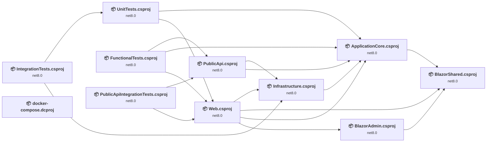

## Project Details

### docker-compose.dcproj

#### Project Info

- **Current Target Framework:** ✅
- **SDK-style**: True
- **Project Kind:** DotNetCoreApp
- **Dependencies**: 0
- **Dependants**: 0
- **Number of Files**: 0
- **Lines of Code**: 0
- **Estimated LOC to modify**: 0+ (at least 0,0% of the project)

#### Dependency Graph

Legend:
📦 SDK-style project
⚙️ Classic project

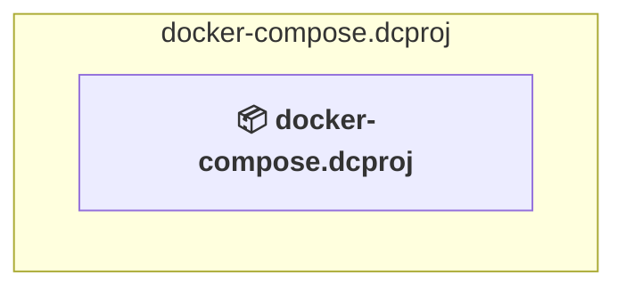

### API Compatibility

| Category | Count | Impact |
| :--- | :---: | :--- |
| 🔴 Binary Incompatible | 0 | High - Require code changes |
| 🟡 Source Incompatible | 0 | Medium - Needs re-compilation and potential conflicting API error fixing |
| 🔵 Behavioral change | 0 | Low - Behavioral changes that may require testing at runtime |
| ✅ Compatible | 0 |  |
| ***Total APIs Analyzed*** | ***0*** |  |

### src\ApplicationCore\ApplicationCore.csproj

#### Project Info

- **Current Target Framework:** net8.0
- **Proposed Target Framework:** net10.0
- **SDK-style**: True
- **Project Kind:** ClassLibrary
- **Dependencies**: 1
- **Dependants**: 5
- **Number of Files**: 39
- **Number of Files with Incidents**: 1
- **Lines of Code**: 775
- **Estimated LOC to modify**: 0+ (at least 0,0% of the project)

#### Dependency Graph

Legend:
📦 SDK-style project
⚙️ Classic project

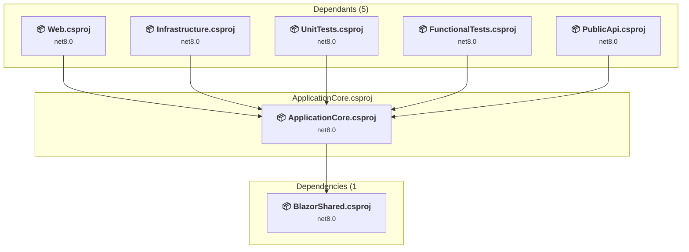

### API Compatibility

| Category | Count | Impact |
| :--- | :---: | :--- |
| 🔴 Binary Incompatible | 0 | High - Require code changes |
| 🟡 Source Incompatible | 0 | Medium - Needs re-compilation and potential conflicting API error fixing |
| 🔵 Behavioral change | 0 | Low - Behavioral changes that may require testing at runtime |
| ✅ Compatible | 1007 |  |
| ***Total APIs Analyzed*** | ***1007*** |  |

### src\BlazorAdmin\BlazorAdmin.csproj

#### Project Info

- **Current Target Framework:** net8.0
- **Proposed Target Framework:** net10.0
- **SDK-style**: True
- **Project Kind:** AspNetCore
- **Dependencies**: 1
- **Dependants**: 1
- **Number of Files**: 48
- **Number of Files with Incidents**: 4
- **Lines of Code**: 969
- **Estimated LOC to modify**: 7+ (at least 0,7% of the project)

#### Dependency Graph

Legend:
📦 SDK-style project
⚙️ Classic project

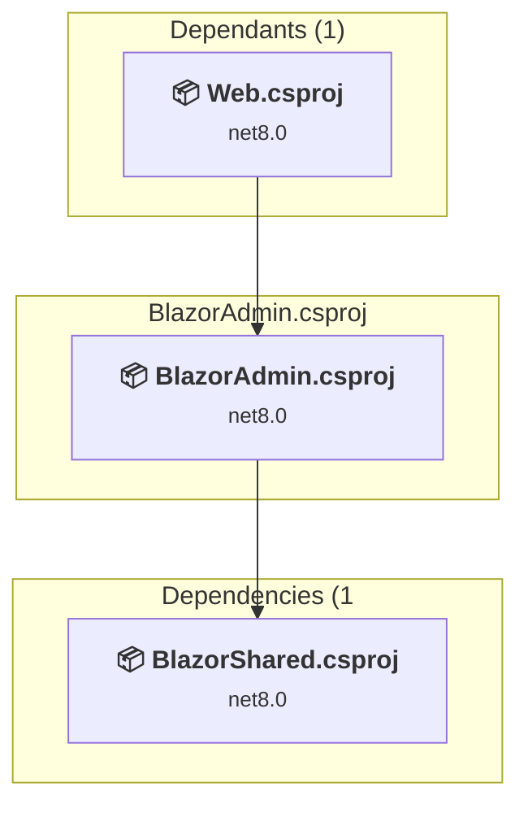

### API Compatibility

| Category | Count | Impact |
| :--- | :---: | :--- |
| 🔴 Binary Incompatible | 1 | High - Require code changes |
| 🟡 Source Incompatible | 0 | Medium - Needs re-compilation and potential conflicting API error fixing |
| 🔵 Behavioral change | 6 | Low - Behavioral changes that may require testing at runtime |
| ✅ Compatible | 3448 |  |
| ***Total APIs Analyzed*** | ***3455*** |  |

### src\BlazorShared\BlazorShared.csproj

#### Project Info

- **Current Target Framework:** net8.0
- **Proposed Target Framework:** net10.0
- **SDK-style**: True
- **Project Kind:** ClassLibrary
- **Dependencies**: 0
- **Dependants**: 3
- **Number of Files**: 20
- **Number of Files with Incidents**: 1
- **Lines of Code**: 290
- **Estimated LOC to modify**: 0+ (at least 0,0% of the project)

#### Dependency Graph

Legend:
📦 SDK-style project
⚙️ Classic project

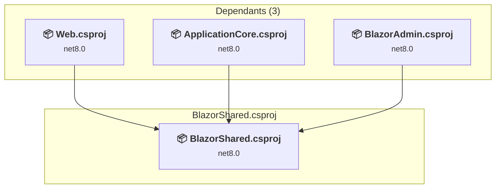

### API Compatibility

| Category | Count | Impact |
| :--- | :---: | :--- |
| 🔴 Binary Incompatible | 0 | High - Require code changes |
| 🟡 Source Incompatible | 0 | Medium - Needs re-compilation and potential conflicting API error fixing |
| 🔵 Behavioral change | 0 | Low - Behavioral changes that may require testing at runtime |
| ✅ Compatible | 279 |  |
| ***Total APIs Analyzed*** | ***279*** |  |

### src\Infrastructure\Infrastructure.csproj

#### Project Info

- **Current Target Framework:** net8.0
- **Proposed Target Framework:** net10.0
- **SDK-style**: True
- **Project Kind:** ClassLibrary
- **Dependencies**: 1
- **Dependants**: 3
- **Number of Files**: 29
- **Number of Files with Incidents**: 2
- **Lines of Code**: 2910
- **Estimated LOC to modify**: 4+ (at least 0,1% of the project)

#### Dependency Graph

Legend:
📦 SDK-style project
⚙️ Classic project

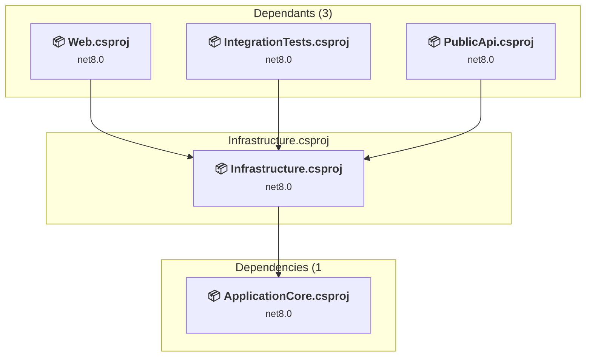

### API Compatibility

| Category | Count | Impact |
| :--- | :---: | :--- |
| 🔴 Binary Incompatible | 4 | High - Require code changes |
| 🟡 Source Incompatible | 0 | Medium - Needs re-compilation and potential conflicting API error fixing |
| 🔵 Behavioral change | 0 | Low - Behavioral changes that may require testing at runtime |
| ✅ Compatible | 3649 |  |
| ***Total APIs Analyzed*** | ***3653*** |  |

#### Project Technologies and Features

| Technology | Issues | Percentage | Migration Path |
| :--- | :---: | :---: | :--- |
| IdentityModel & Claims-based Security | 4 | 100,0% | Windows Identity Foundation (WIF), SAML, and claims-based authentication APIs that have been replaced by modern identity libraries. WIF was the original identity framework for .NET Framework. Migrate to Microsoft.IdentityModel.* packages (modern identity stack). |

### src\PublicApi\PublicApi.csproj

#### Project Info

- **Current Target Framework:** net8.0
- **Proposed Target Framework:** net10.0
- **SDK-style**: True
- **Project Kind:** AspNetCore
- **Dependencies**: 2
- **Dependants**: 2
- **Number of Files**: 38
- **Number of Files with Incidents**: 2
- **Lines of Code**: 1085
- **Estimated LOC to modify**: 16+ (at least 1,5% of the project)

#### Dependency Graph

Legend:
📦 SDK-style project
⚙️ Classic project

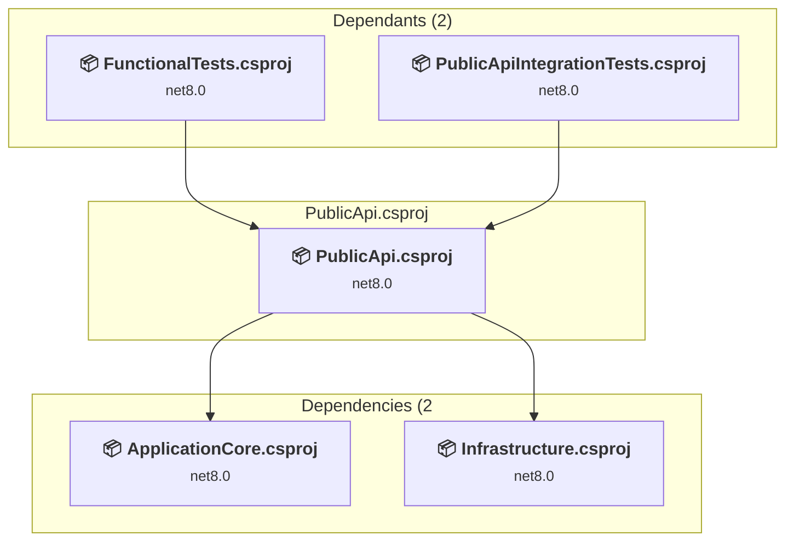

### API Compatibility

| Category | Count | Impact |
| :--- | :---: | :--- |
| 🔴 Binary Incompatible | 6 | High - Require code changes |
| 🟡 Source Incompatible | 9 | Medium - Needs re-compilation and potential conflicting API error fixing |
| 🔵 Behavioral change | 1 | Low - Behavioral changes that may require testing at runtime |
| ✅ Compatible | 1218 |  |
| ***Total APIs Analyzed*** | ***1234*** |  |

### src\Web\Web.csproj

#### Project Info

- **Current Target Framework:** net8.0
- **Proposed Target Framework:** net10.0
- **SDK-style**: True
- **Project Kind:** AspNetCore
- **Dependencies**: 4
- **Dependants**: 3
- **Number of Files**: 185
- **Number of Files with Incidents**: 7
- **Lines of Code**: 4058
- **Estimated LOC to modify**: 27+ (at least 0,7% of the project)

#### Dependency Graph

Legend:
📦 SDK-style project
⚙️ Classic project

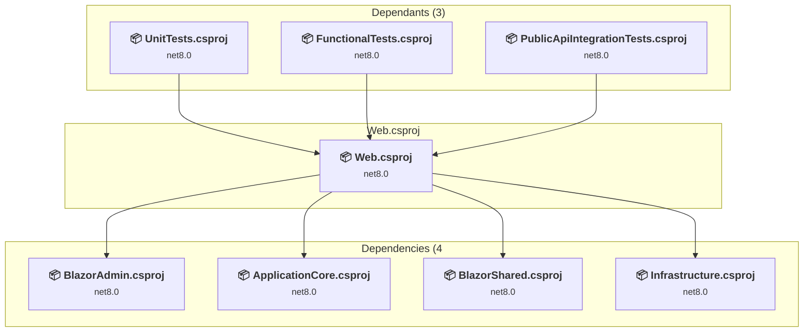

### API Compatibility

| Category | Count | Impact |
| :--- | :---: | :--- |
| 🔴 Binary Incompatible | 7 | High - Require code changes |
| 🟡 Source Incompatible | 11 | Medium - Needs re-compilation and potential conflicting API error fixing |
| 🔵 Behavioral change | 9 | Low - Behavioral changes that may require testing at runtime |
| ✅ Compatible | 18271 |  |
| ***Total APIs Analyzed*** | ***18298*** |  |

### tests\FunctionalTests\FunctionalTests.csproj

#### Project Info

- **Current Target Framework:** net8.0
- **Proposed Target Framework:** net10.0
- **SDK-style**: True
- **Project Kind:** DotNetCoreApp
- **Dependencies**: 3
- **Dependants**: 0
- **Number of Files**: 14
- **Number of Files with Incidents**: 9
- **Lines of Code**: 625
- **Estimated LOC to modify**: 33+ (at least 5,3% of the project)

#### Dependency Graph

Legend:
📦 SDK-style project
⚙️ Classic project

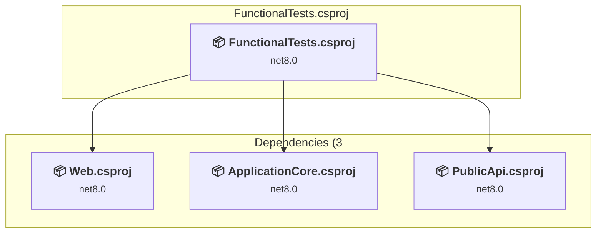

### API Compatibility

| Category | Count | Impact |
| :--- | :---: | :--- |
| 🔴 Binary Incompatible | 4 | High - Require code changes |
| 🟡 Source Incompatible | 0 | Medium - Needs re-compilation and potential conflicting API error fixing |
| 🔵 Behavioral change | 29 | Low - Behavioral changes that may require testing at runtime |
| ✅ Compatible | 869 |  |
| ***Total APIs Analyzed*** | ***902*** |  |

#### Project Technologies and Features

| Technology | Issues | Percentage | Migration Path |
| :--- | :---: | :---: | :--- |
| IdentityModel & Claims-based Security | 4 | 12,1% | Windows Identity Foundation (WIF), SAML, and claims-based authentication APIs that have been replaced by modern identity libraries. WIF was the original identity framework for .NET Framework. Migrate to Microsoft.IdentityModel.* packages (modern identity stack). |

### tests\IntegrationTests\IntegrationTests.csproj

#### Project Info

- **Current Target Framework:** net8.0
- **Proposed Target Framework:** net10.0
- **SDK-style**: True
- **Project Kind:** DotNetCoreApp
- **Dependencies**: 2
- **Dependants**: 0
- **Number of Files**: 5
- **Number of Files with Incidents**: 1
- **Lines of Code**: 147
- **Estimated LOC to modify**: 0+ (at least 0,0% of the project)

#### Dependency Graph

Legend:
📦 SDK-style project
⚙️ Classic project

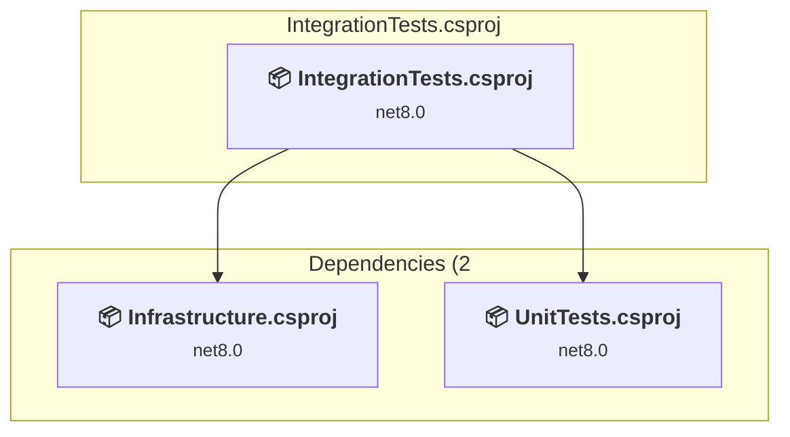

### API Compatibility

| Category | Count | Impact |
| :--- | :---: | :--- |
| 🔴 Binary Incompatible | 0 | High - Require code changes |
| 🟡 Source Incompatible | 0 | Medium - Needs re-compilation and potential conflicting API error fixing |
| 🔵 Behavioral change | 0 | Low - Behavioral changes that may require testing at runtime |
| ✅ Compatible | 217 |  |
| ***Total APIs Analyzed*** | ***217*** |  |

### tests\PublicApiIntegrationTests\PublicApiIntegrationTests.csproj

#### Project Info

- **Current Target Framework:** net8.0
- **Proposed Target Framework:** net10.0
- **SDK-style**: True
- **Project Kind:** DotNetCoreApp
- **Dependencies**: 2
- **Dependants**: 0
- **Number of Files**: 10
- **Number of Files with Incidents**: 7
- **Lines of Code**: 300
- **Estimated LOC to modify**: 11+ (at least 3,7% of the project)

#### Dependency Graph

Legend:
📦 SDK-style project
⚙️ Classic project

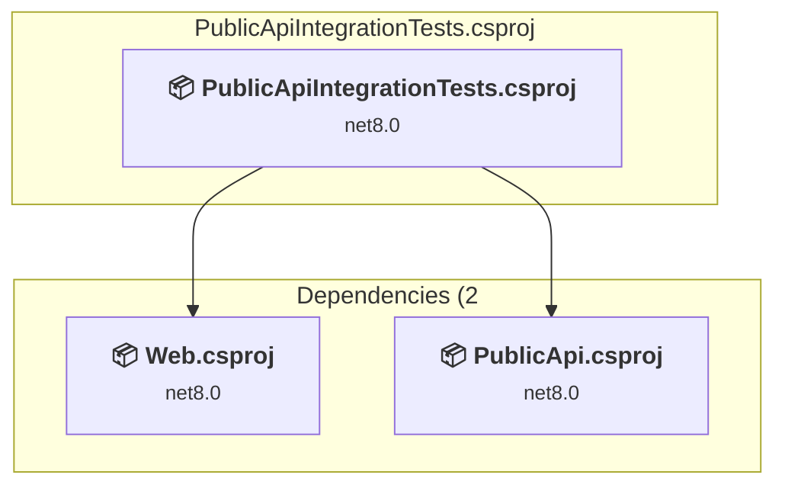

### API Compatibility

| Category | Count | Impact |
| :--- | :---: | :--- |
| 🔴 Binary Incompatible | 4 | High - Require code changes |
| 🟡 Source Incompatible | 0 | Medium - Needs re-compilation and potential conflicting API error fixing |
| 🔵 Behavioral change | 7 | Low - Behavioral changes that may require testing at runtime |
| ✅ Compatible | 366 |  |
| ***Total APIs Analyzed*** | ***377*** |  |

#### Project Technologies and Features

| Technology | Issues | Percentage | Migration Path |
| :--- | :---: | :---: | :--- |
| IdentityModel & Claims-based Security | 4 | 36,4% | Windows Identity Foundation (WIF), SAML, and claims-based authentication APIs that have been replaced by modern identity libraries. WIF was the original identity framework for .NET Framework. Migrate to Microsoft.IdentityModel.* packages (modern identity stack). |

### tests\UnitTests\UnitTests.csproj

#### Project Info

- **Current Target Framework:** net8.0
- **Proposed Target Framework:** net10.0
- **SDK-style**: True
- **Project Kind:** DotNetCoreApp
- **Dependencies**: 2
- **Dependants**: 1
- **Number of Files**: 27
- **Number of Files with Incidents**: 1
- **Lines of Code**: 1021
- **Estimated LOC to modify**: 0+ (at least 0,0% of the project)

#### Dependency Graph

Legend:
📦 SDK-style project
⚙️ Classic project

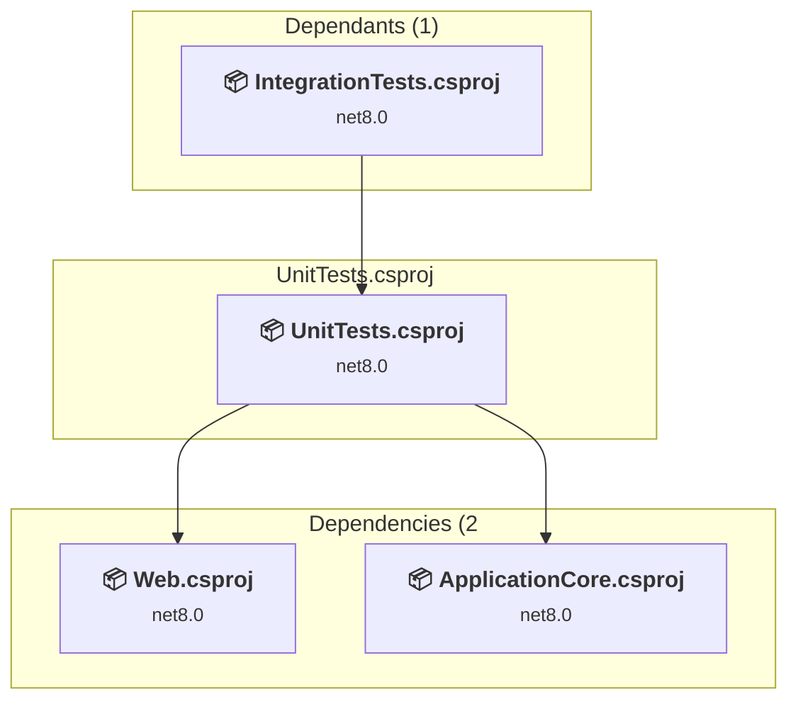

### API Compatibility

| Category | Count | Impact |
| :--- | :---: | :--- |
| 🔴 Binary Incompatible | 0 | High - Require code changes |
| 🟡 Source Incompatible | 0 | Medium - Needs re-compilation and potential conflicting API error fixing |
| 🔵 Behavioral change | 0 | Low - Behavioral changes that may require testing at runtime |
| ✅ Compatible | 1347 |  |
| ***Total APIs Analyzed*** | ***1347*** |  |

